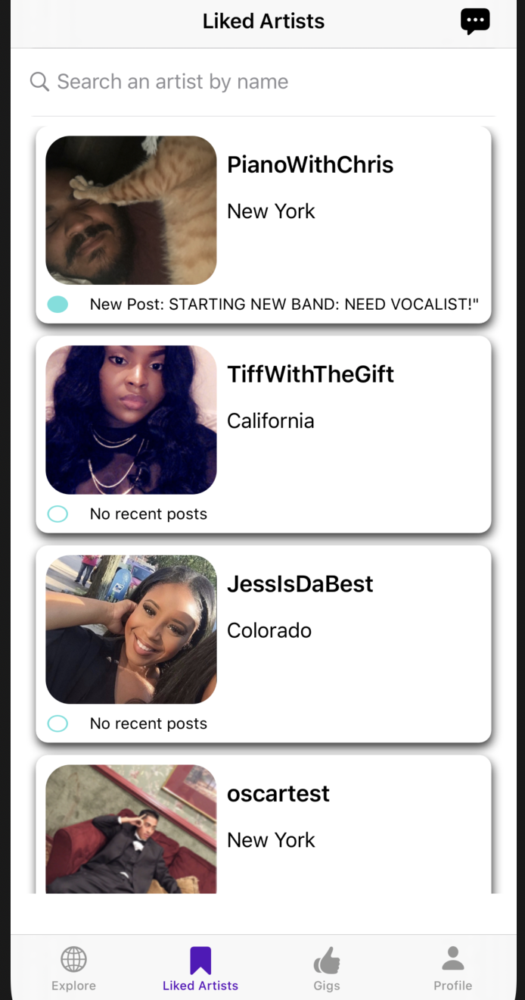
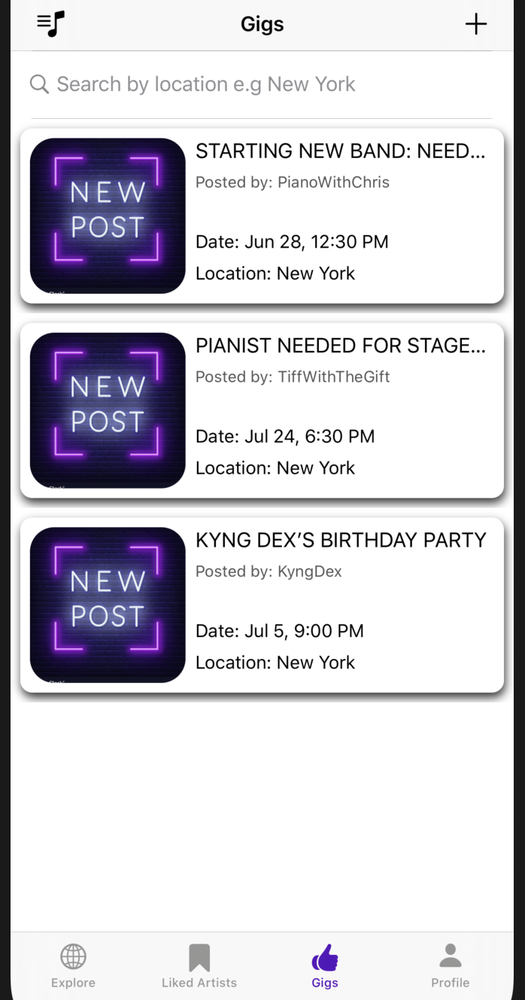
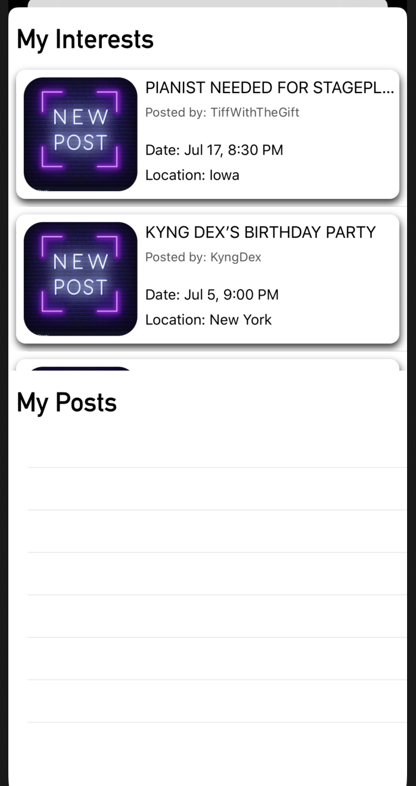
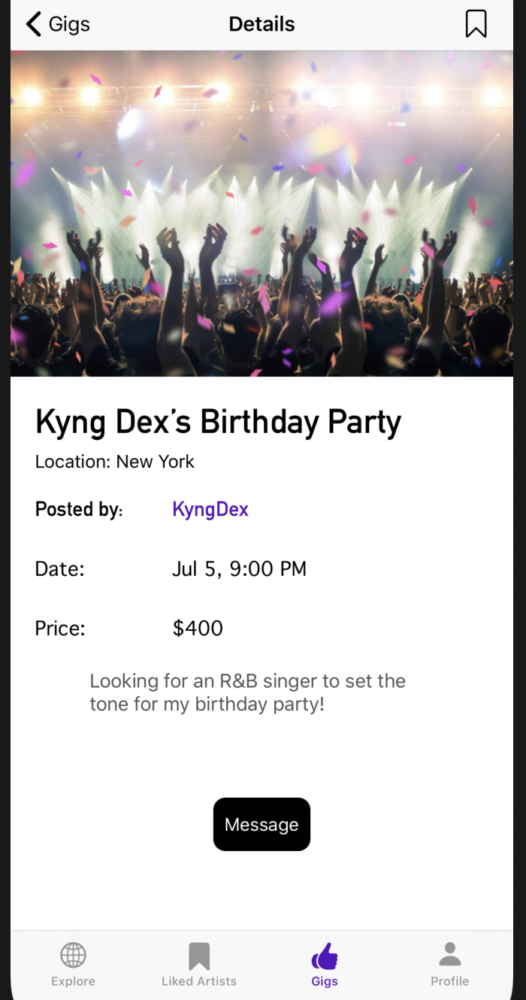
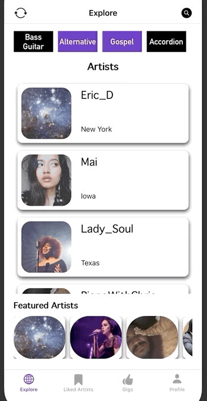

# InTune: Connect with Artist

Winning 6-week Capstone Project: Won the 'Best In Class App' award, awarded by staff from the Capital One team. 

## Description 

InTune is an app where artists can show off their skills and make a living. InTune connects artists and enthusiasts, creating a virtual community and a networking system.

Artists and enthusiasts need to create an account and give us some basic information about themselves and their interests.Artists can post videos, like other artists as well as collaborate with other artists. All users can like their favorite artists. Artists can chat with other artists. Enthusiasts can chat with artists. Everyone can post gigs, to find artists for their private events.

## Screenshots

**Liked Artist Tab**

**Gigs Tab**

## Gifs

**Find artists using tags**

**Starting a chat with an artist**

## Features
Posting Videos

   
  
   

## Code Snippet 

## Technologies

This project includes cocoapods such as MessageKit and Kingfisher to facilitate the production of the app. MessageKit was used to create conversations between our users for the chat features. Kingfisher was used to access images faster on the product. Firebase was used to organize and store user data.

## Requirements

## Installation 

## Contributors 

**[Maitree Bain](https://github.com/maitreebain)**

**[Tiffany Obi](https://github.com/TiffanyObi)**

**[Christian Hurtado](https://github.com/ChristianHurtado29)**

**[Oscar Victoria Gonzales](https://github.com/oscarvictoria)**

## FAQ

## Support

