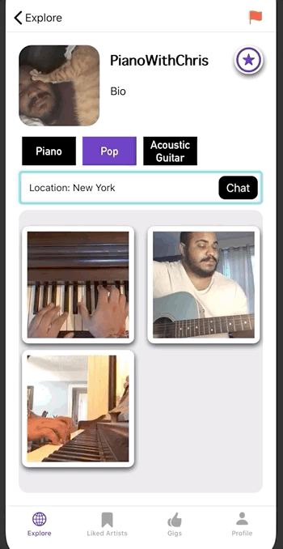

# InTune: Connect with Artist

Winning 6-week Capstone Project: Won the 'Best In Class App' award, awarded by staff from the Capital One team. 

## Description 

InTune is an app where artists can show off their skills and make a living. In tune connects artists and enthusiasts, creating a virtual community and a networking system.

Artists and enthusiasts need to create an account and give us some basic information about themselves and their interests.Artists can post videos, like other artists as well as collaborate with other artists. All users can like their favorite artists. Artists can chat with other artists. Enthusiasts can chat with artists. Everyone can post gigs, to find artists for their private events.

## Screenshot

**Liked Artist Tab**

**Gigs Tab**

## Gif

**Find artists using tags**

**Starting a chat with an artist**

## Features

## Code Snippet 

## Technologies

## Requirements

## Installation 

## Contributors 

**[Maitree Bain](https://github.com/maitreebain)**

**[Tiffany Obi](https://github.com/TiffanyObi)**

**[Christian Hurtado](https://github.com/ChristianHurtado29)**

**[Oscar Victoria Gonzales](https://github.com/oscarvictoria)**

## FAQ

## Support

